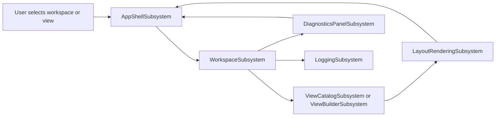

# SysML2Workbench

## Architecture

SysML2Workbench is a thin desktop shell over the SysML2Tools parser, semantic
model, and layout engine, plus the DemaConsulting.Rendering SVG pipeline. The
system is organized into seven subsystems. WorkspaceSubsystem owns folder
discovery, import-aware loading, and live reload. ViewCatalogSubsystem exposes
the predefined model views already authored in the workspace. ViewBuilderSubsystem
captures session-only custom view intent and converts it into copy-pasteable
SysML text. LayoutRenderingSubsystem turns a selected predefined or custom view
into rendered SVG. DiagnosticsPanelSubsystem presents workspace diagnostics to
the user. LoggingSubsystem persists a local rolling log for troubleshooting.
AppShellSubsystem coordinates the main window, navigation, tab lifecycle, and
cross-subsystem user interactions.

The collaboration pattern is intentionally one-directional. AppShellSubsystem
accepts user commands, WorkspaceSubsystem produces the authoritative loaded
model and diagnostics, the catalog or custom-view builder selects the view to
render, LayoutRenderingSubsystem produces the diagram payload, and
DiagnosticsPanelSubsystem and LoggingSubsystem present secondary outputs. The
system does not reimplement parsing, semantic resolution, or diagram layout;
those concerns stay inside the OTS dependencies so the local code remains
focused on orchestration and presentation.

## External Interfaces

**Desktop User Interface**: The cross-platform windowed interface through which
users open workspaces, select views, inspect diagnostics, and pan or zoom
rendered diagrams.

- *Type*: Desktop GUI.
- *Role*: Provider.
- *Contract*: Exposes the main window shell, view catalog, custom view builder,
  diagnostics panel, and SVG canvas interactions driven by keyboard and pointer
  input.
- *Constraints*: Operates locally with no authentication flow, must remain
  responsive while long-running parsing or layout work is in progress, and must
  tolerate invalid workspace content by surfacing diagnostics instead of
  terminating.

**Workspace File System**: The set of folders and `.sysml` files opened as a
live workspace.

- *Type*: File system.
- *Role*: Consumer.
- *Contract*: Reads folder contents, resolves glob-discovered model files,
  follows SysML `import` relationships, and observes file create/change/delete
  notifications.
- *Constraints*: Must treat the file system as mutable, must survive partial
  writes or temporarily missing files, and must not require repository or git
  metadata.

**Local Log Files**: The persistent rolling log written for bug reports and
local troubleshooting.

- *Type*: File system.
- *Role*: Provider.
- *Contract*: Writes timestamped application events and failure details to a
  bounded rotating set of files under a user-accessible local directory.
- *Constraints*: Logging is best-effort, must not block the UI thread, and must
  limit file growth by rotation.

## Dependencies

- **SysML2Tools**: Provides parsing, semantic resolution, standard library
  loading, and view-to-layout translation; see *SysML2Tools Integration Design*.
- **Rendering**: Produces the SVG artifact displayed in the workbench canvas;
  see *Rendering Integration Design*.
- **Avalonia**: Provides the desktop UI framework, control model, and
  application lifetime; see *Avalonia Integration Design*.
- **XUnit**: Provides the repository's automated verification framework; see
  *XUnit Integration Design*.

## Risk Control Measures

N/A - not a safety-classified software item.

## Data Flow

1. AppShellSubsystem receives a user action such as opening a folder, selecting
   a predefined view, or constructing a custom view.
2. WorkspaceSubsystem loads or refreshes the workspace, resolves imports, and
   aggregates parser and semantic diagnostics for the currently known files.
3. ViewCatalogSubsystem derives the set of predefined views from the loaded
   model, or ViewBuilderSubsystem produces an ephemeral custom-view definition
   from UI input.
4. LayoutRenderingSubsystem invokes `DiagramRenderer.RenderWorkspace` for the
   selected definition and uses DemaConsulting.Rendering to produce SVG for
   display.
5. AppShellSubsystem presents the rendered diagram, DiagnosticsPanelSubsystem
   updates the diagnostic list, and LoggingSubsystem records notable operations
   and failures.

## Design Constraints

- Platform: the system is a desktop-only .NET application targeting Windows,
  Linux, and macOS through Avalonia.
- Architecture: parsing, semantic analysis, and layout must remain delegated to
  the SysML2Tools packages rather than being reimplemented locally.
- Persistence: GUI-built custom views are session-only and are persisted only
  by exporting standard SysML `view ... expose ...` text.
- Responsiveness: workspace reload and diagram refresh must support iterative,
  externally edited modeling workflows without forcing the user to reopen the
  folder.
- Security: the application operates on local files only, has no authentication
  or network surface, and should minimize writes to the local log directory.
- Performance: the workbench is optimized for typical engineering workspaces,
  while large-model layout performance remains the responsibility of the
  underlying OTS packages.
